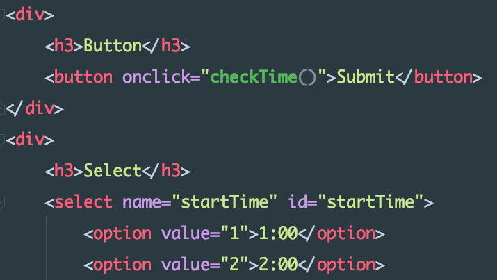
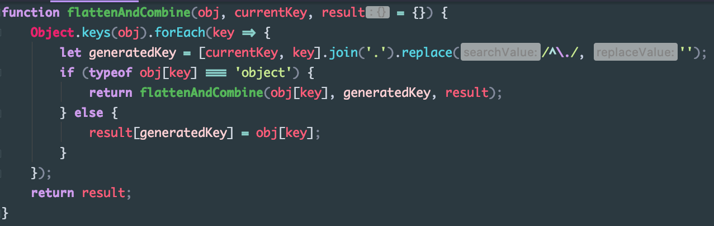
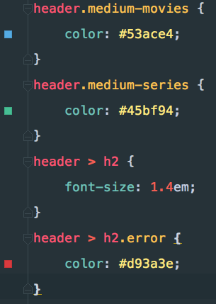
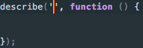
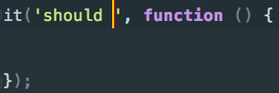
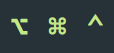

# Configuration files

[vim configuration](./vim/README-en.md)

 

## Webstorm

> tl;dr [Click me](#install)

### Preview

#### HTML

#### JavaScript

#### CSS

#### More ...
[AngularJS](./assets/AngularJS.png)
[TypeScript](./assets/TypeScript.png)
[Lua](./assets/Lua.png) **（Require [Lua Plugin](https://plugins.jetbrains.com/plugin/5055?pr=)）**
[Sass](./assets/Sass.png)

### Install
1. Download Webstorm-2016-10-23.jar
2. Goto `File -> Import Settings` and import that `.jar` file you just downloaded
3. Goto `WebStorm -> Preferences -> Plugins -> Browse Repositories`, Search for `Material Theme UI` and install this Plugin
4. Restart WebStorm
    - Non Mac users may need a little more settings, click [here](#Notice) 

### Live Template
**Type in Keywords and hit Tab**

- JavaScript
    - Use keyword `desc`, `it` for adding `describe` and `it` block in test files
        - Caret of `describe` locates inside the quotes. Hitting tab again will jump to function body
            
        - Caret of `it` locates after "should". Hitting tab again will jump to function body
            
- Lua
    - Use `---` to insert block comment
- Global
    - Use `:alt`, `:cmd`, `:ctrl` and `:shift` `:up` to insert Mac key icon (Unicode)
    
        

### Notice
**For Windows and Linux users, you might need the following settings:**
- My default font is "Menlo". You can change that  in `WebStorm -> Preferences -> Editor -> Colors & Fonts -> Font`
- My default Keymap might not fit your system. Goto `WebStorm -> Preferences -> Keymap` and change the "Keymaps" attribute

