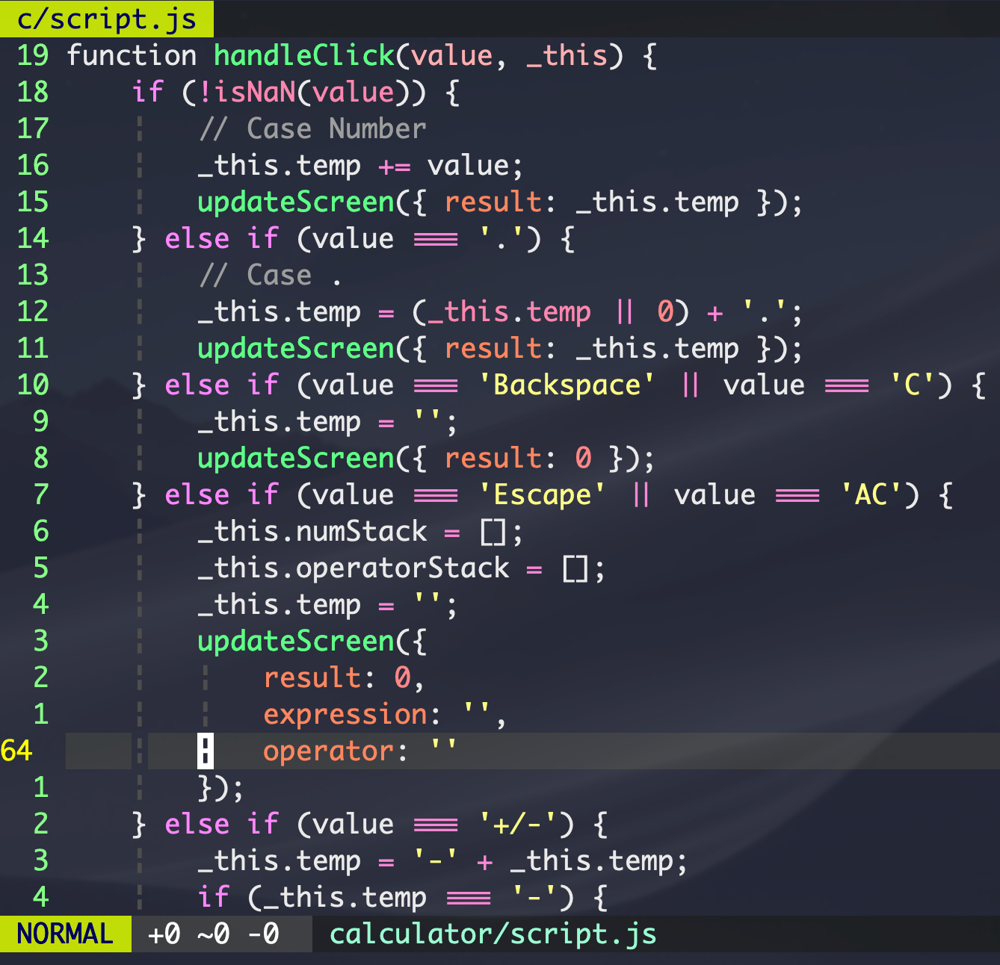

# 一些配置文件

[vim 配置文件](./vim/README.md)

 

## 我使用的字体（4/14/2019 更新）
使用 [Ligaturizer](https://github.com/ToxicFrog/Ligaturizer) build 的 LigaMonaco，包含两个版本：
- [常规体](./font/LigaMonaco.ttf)
- [粗体](./font/LigaMonacoBold.ttf)

### 预览

## Webstorm

> 安装方法：[点我](#安装)

### 预览

#### HTML

#### JavaScript

#### CSS

#### 更多
[AngularJS](./assets/AngularJS.png)
[TypeScript](./assets/TypeScript.png)
[Lua](./assets/Lua.png) **（需要引入 [Lua 插件](https://plugins.jetbrains.com/plugin/5055?pr=)）**
[Sass](./assets/Sass.png)

### 安装
1. 下载 Webstorm-2016-10-23.jar
2. 在 WebStorm 中，选择 `File -> Import Settings`，导入下载好的 `.jar` 文件
3. 打开 `WebStorm -> Preferences -> Plugins -> Browse Repositories`，搜索 Material Theme UI 并安装
    - 如果安装不成功，点 [这里](https://plugins.jetbrains.com/plugin/8006?pr=) 下载然后手动安装
4. 重启 WebStorm，完成安装
    - 非 Mac 用户可能还需要些后续设置，点[这里](#注意事项) 

### 自定义 Template
**触发方式：输入关键字后按 Tab**

- JavaScript
    - `desc`, `it` 可以在测试文件中添加 `describe` 和 `it` block
        - `describe` 的光标默认在引号之间，再按 Tab 可以跳至 `function` 内
          
        - `it` 光标默认在 `should` 后，再按 Tab 可跳至 `function` 内
         
          
- Lua
    - `---` 可以插入注释块
- 全局
    - `:alt`, `:cmd`, `:ctrl` 以及 `:shift` `:up` 等可以快速插入 Mac 键位图标 （Unicode编码）
    
        

### 注意事项
**Windows 和 Linux 用户可能还需要以下设置：**
- 我的默认字体是 Menlo，如果出现字体兼容性问题，在 `WebStorm -> Preferences -> Editor -> Colors & Fonts -> Font` 里面把 `Primary font` 改成可以兼容的字体
- 我的默认键位是 Mac 键位，如果用在其他系统上，需要在 `WebStorm -> Preferences -> Keymap -> Keymaps` 里面改成系统对应的选项

